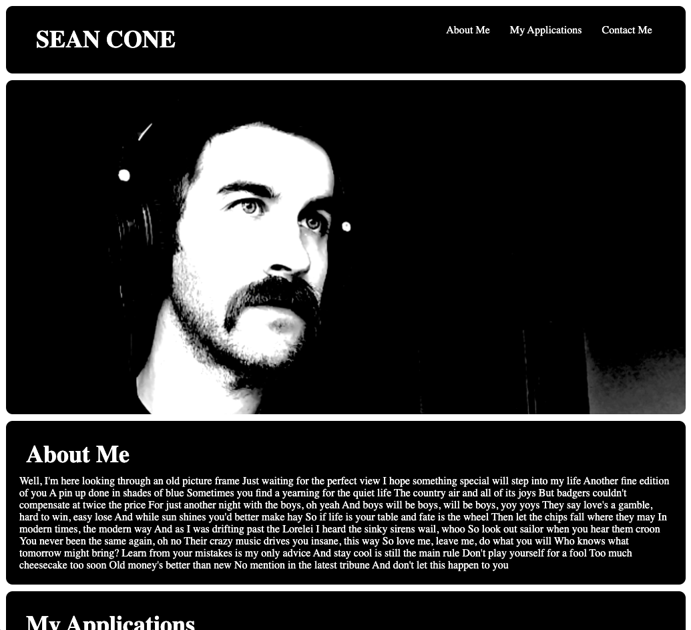

# Professional Portfolio

Welcome to the README for my second project as a student of Coding Boot Camp at UCLA Extension: My professional portfolio.

## Description

My second project is to present a deployed portfolio of work samples for prospective employers. I used Flexbox, CSS Grid Layout, media queries and CSS variables to create an appealing page showing off my work (or at least placeholders for what will be my work). Included are my name, picture, links to About Me, My Applications and Contact Me. The My Applications link scrolls to the section with titled images of my applications, and all images and links are functioning. 

## Link

[Professional Portfolio](https://seanc0ne.github.io/professional-portfolio/)

## Screenshot

